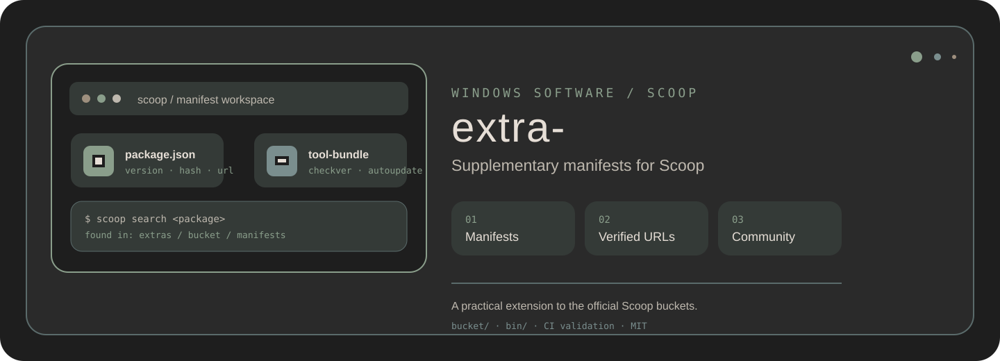

<div align="center">
  

  <h1>extra-</h1>
  <p><strong>An independent Scoop bucket for practical Windows software that complements the official ecosystem.</strong></p>
  <p>Manifest-driven · SHA-256 aware · Scoop-native · PowerShell maintained</p>

  <p>
    <a href="https://scoop.sh"></a>
    <a href="https://github.com/CYoJkoY/extras-"></a>
    </a>
    <a href="./LICENSE"></a>
  </p>

  <p><a href="#quick-start">Quick start</a> · <a href="#what-is-in-the-bucket">Packages</a> · <a href="#maintaining-a-manifest">Maintain</a> · <a href="#security-model">Security</a></p>
</div>

## What it is

**extra-** is a supplementary [Scoop](https://scoop.sh) bucket maintained by [@CYojkoY](https://github.com/CYoJkoY). The repository stores Scoop manifests and maintenance scripts; it does not host application binaries.

The bucket is intended for additional utilities and specialized Windows applications that are useful to this repository's users without pretending to be part of the official Scoop collections.

A manifest describes where software comes from, which version to install, how Scoop should expose it, and—when available—the expected SHA-256 hash.

> **Scope:** package availability and update behavior ultimately depend on upstream publishers and the Scoop ecosystem.

## Quick start

Prerequisites: Windows and [Scoop](https://scoop.sh).

```powershell
scoop bucket add extras https://github.com/CYoJkoY/extras-
scoop search <package>
scoop install extras/<package>
```

Useful day-to-day commands:

| Task | Command |
| :--- | :--- |
| Update bucket metadata | `scoop update` |
| Update one package | `scoop update <package>` |
| Inspect a package | `scoop info extras/<package>` |
| List installed packages | `scoop list` |
| Remove a package | `scoop uninstall <package>` |

The bucket name above is the local Scoop alias `extras`; it does not imply ownership by Scoop's official project.

## What is in the bucket

Manifest files live under `bucket/`. Current repository examples include:

- `Context-Menu-Manager-Plus.json`
- `defender-control-disable.json`
- `defender-control-enable.json`
- `project-graph.json`
- `RealWorld-Cursor-Editor.json`
- `Windhawk-dev.json`

Use `scoop search <package>` for the current catalog rather than relying on this README as a package index.

## Why manifest-based packaging

The repository follows Scoop's normal package model instead of checking application payloads into Git.

```text
manifest.json
    │
    ├── version + download URL
    ├── expected hash
    ├── install / shim rules
    └── version-discovery metadata
            │
            ▼
          Scoop
            │
            ▼
     upstream software
```

This keeps the repository lightweight while retaining the metadata needed to reproduce and review an installation definition.

## Maintaining a manifest

Create or update a JSON file under `bucket/`.

### Add a package

1. Start from an official upstream homepage and download location.
2. Create `bucket/<package>.json` using the Scoop manifest schema.
3. Verify the URL, version, and SHA-256 hash.
4. Test the manifest locally.
5. Submit the change through GitHub.

Example:

```powershell
scoop install ./bucket/example-tool.json
```

### Update a package

Refresh the version and download URL, then recalculate the hash and test the new manifest.

```powershell
scoop hash <downloaded-file>
scoop install ./bucket/<package>.json
```

### Common fields

| Field | Purpose |
| :--- | :--- |
| `version` | Current upstream version |
| `description` | Human-readable package description |
| `homepage` | Official software homepage |
| `license` | Upstream license identifier |
| `url` | Download URL or URL collection |
| `hash` | Expected SHA-256 digest |
| `bin` | Executables exposed through Scoop shims |
| `depends` | Required Scoop dependencies |
| `extract_dir` | Directory used after extraction |
| `checkver` | Rules for discovering newer versions |
| `autoupdate` | Templates for future download URLs |

## Repository maintenance tooling

PowerShell helpers in `bin/` support repeatable bucket maintenance:

```text
bin/
├── auto-pr.ps1
├── checkhashes.ps1
├── checkurls.ps1
├── checkver.ps1
├── formatjson.ps1
├── missing-checkver.ps1
└── test.ps1
```

They cover tasks such as URL checks, hash checks, version checks, formatting, and local manifest testing.

## Security model

The repository contains manifests and maintenance scripts rather than application binaries.

A valid SHA-256 hash verifies that a downloaded file matches the manifest expectation. It does **not** prove that the upstream software is trustworthy or safe.

Before installing software, review its upstream homepage and download source, especially for applications that request elevated privileges.

When reporting a security or manifest issue, do not publish credentials, tokens, private URLs, or sensitive machine information.

## Project structure

```text
extras-/
├── .github/workflows/
├── assets/
│   ├── bar.svg
│   ├── dots.svg
│   ├── hero.svg
│   └── logo-placeholder.svg
├── bin/
│   ├── auto-pr.ps1
│   ├── checkhashes.ps1
│   ├── checkurls.ps1
│   ├── checkver.ps1
│   ├── formatjson.ps1
│   ├── missing-checkver.ps1
│   └── test.ps1
├── bucket/
│   ├── app-name.json.template
│   ├── Context-Menu-Manager-Plus.json
│   ├── defender-control-disable.json
│   ├── defender-control-enable.json
│   ├── project-graph.json
│   ├── RealWorld-Cursor-Editor.json
│   ├── Windhawk-dev.json
│   └── ...
├── LICENSE
└── README.md
```

## Contributing

Issues and pull requests are welcome.

For a manifest change, include the official software name and homepage, a working download URL, the correct version, a SHA-256 hash when supported, and evidence of a successful local installation test. Add `checkver` and `autoupdate` metadata when practical.

For package suggestions, explain why the software is useful and why a dedicated manifest here is appropriate rather than duplicating an official Scoop bucket.

## Support

If this bucket saves you time finding or maintaining Windows software, development support is available through the deployed payment page:

**https://cyojkoy.github.io/Payment/**

## License

This project is licensed under the **MIT License**.

See [`LICENSE`](./LICENSE) for the complete license text.

<div align="center">
  <sub>extra- · practical Windows software through Scoop manifests.</sub>
</div>
