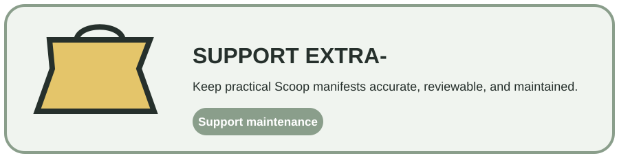

<div align="center">
  
  <h1>extra-</h1>
  <p><strong>A focused Scoop bucket for practical Windows software outside the official collections.</strong></p>
  <p>Manifest-driven · Scoop-native · SHA-256 aware · PowerShell maintained</p>
  <p>
    <a href="https://scoop.sh"></a>
    <a href="https://github.com/CYoJkoY/extras-"></a>
    
    <a href="./LICENSE"></a>
  </p>
  <p><a href="#what-it-is">Overview</a> · <a href="#packages">Packages</a> · <a href="#manifest-model">Manifest model</a> · <a href="#installation">Install</a> · <a href="#maintenance--support">Maintenance</a></p>
</div>

> **Boundary:** this repository stores Scoop manifests and maintenance tooling. It does not redistribute application binaries and is not an official Scoop bucket.

##  What it is

**extra-** is a supplementary [Scoop](https://scoop.sh) bucket maintained by [@CYoJkoY](https://github.com/CYoJkoY). It provides manifests for additional Windows utilities and specialized software that fit this repository's scope.

##  Packages

Current manifests live under `bucket/`; the repository intentionally does not duplicate a full package index in this README.

Representative entries include:

`Context-Menu-Manager-Plus.json` · `defender-control-disable.json` · `defender-control-enable.json` · `project-graph.json` · `RealWorld-Cursor-Editor.json` · `Windhawk-dev.json`

Use Scoop itself for authoritative package availability:

```powershell
scoop search <package>
scoop info extras/<package>
```

##  Manifest model

Scoop consumes the manifest rather than a binary checked into Git:

```text
bucket/<package>.json
        │
        ├── version + upstream URL
        ├── expected SHA-256
        ├── extraction / shim rules
        └── version discovery metadata
                │
                ▼
              Scoop
                │
                ▼
        upstream software
```

Important fields include `version`, `homepage`, `url`, `hash`, `bin`, `depends`, `checkver`, and `autoupdate`.

A SHA-256 match proves downloaded bytes match the manifest expectation; it does not make the upstream software trustworthy by itself.

##  Installation

Requirements: Windows and [Scoop](https://scoop.sh).

```powershell
scoop bucket add extras https://github.com/CYoJkoY/extras-
scoop search <package>
scoop install extras/<package>
```

Common maintenance commands:

```powershell
scoop update
scoop update <package>
scoop uninstall <package>
```

##  Maintenance & support

PowerShell helpers under `bin/` cover URL checks, hash verification, version checks, formatting, missing metadata detection, and local manifest testing.

```text
bin/
├── auto-pr.ps1
├── checkhashes.ps1
├── checkurls.ps1
├── checkver.ps1
├── formatjson.ps1
├── missing-checkver.ps1
└── test.ps1
```

For a package change, verify the official upstream source, version, download URL, SHA-256 digest where supported, and local installation. Inspect PowerShell maintenance changes before executing them.

<a href="https://cyojkoy.github.io/Payment/"></a>

Development support: **https://cyojkoy.github.io/Payment/**

## License

This project is licensed under the **MIT License**.

See [`LICENSE`](./LICENSE) for the complete license text.

<div align="center"><sub>extra- · practical Windows software through Scoop manifests.</sub></div>
