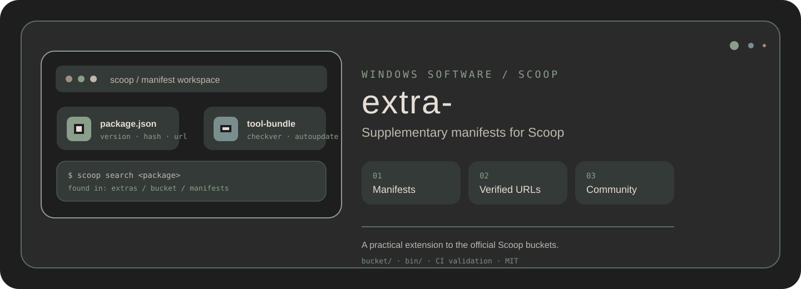
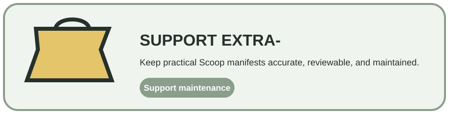

<div align="center">
  
  <h1>extra-</h1>
  <p><strong>A focused Scoop bucket for practical Windows software outside the official collections.</strong></p>
  <p>Manifest-driven · Scoop-native · SHA-256 verified · Automated CI &amp; source builds</p>
  <p>
    <a href="https://scoop.sh"></a>
    <a href="https://github.com/CYoJkoY/extras-/actions/workflows/ci.yml"></a>
    <a href="https://github.com/CYoJkoY/extras-/actions/workflows/openssl-mirror.yml"></a>
    <a href="https://github.com/CYoJkoY/extras-"></a>
    
    <a href="./LICENSE"></a>
  </p>
  <p><a href="#what-it-is">Overview</a> · <a href="#packages">Packages</a> · <a href="#manifest-model">Manifest model</a> · <a href="#installation">Install</a> · <a href="#maintenance--support">Maintenance</a></p>
</div>

> **Boundary:** the Git tree stores Scoop manifests, PowerShell helpers, and GitHub Actions workflows rather than checked-in binaries. Selected GitHub Releases host automated Windows source builds ([`OpenSSL`](https://github.com/CYoJkoY/extras-/releases/tag/OpenSSL)) and mirrored archives ([`3rd-Sordum`](https://github.com/CYoJkoY/extras-/releases/tag/3rd-Sordum), [`TotalUninstaller`](https://github.com/CYoJkoY/extras-/releases/tag/TotalUninstaller)) when upstream sources do not provide stable versioned URLs. This is an independent community bucket, not an official Scoop collection.

##  What it is

**extra-** (`CYoJkoY/extras-`) is a supplementary [Scoop](https://scoop.sh) bucket maintained by [@CYoJkoY](https://github.com/CYoJkoY). It provides curated manifests for Windows utilities, desktop customization tools, input methods, game/system helpers, and multi-stream OpenSSL development packages that complement Scoop's official buckets.

- **Curated Scoop manifests** under [`bucket/`](./bucket), plus [`app-name.json.template`](./bucket/app-name.json.template) for authoring new packages.
- **Automated OpenSSL Windows source builds** across `4.x`, `3.x`, and `1.1.1w` streams (`x64`, `x86`, `arm64`), compiled in GitHub Actions from official [`openssl/openssl`](https://github.com/openssl/openssl) release tags.
- **Continuous maintenance** via scheduled `Excavator` version polling, Pester manifest testing (`powershell` and `pwsh`), and automated issue/PR verification workflows.

##  Packages

All package manifests live under [`bucket/`](./bucket). The README intentionally does **not** maintain a package catalog: the manifest files are the source of truth, and [`Excavator`](./.github/workflows/excavator.yml) can refresh versions automatically every 4 hours. This avoids a wide, stale table that has to be edited every time the bucket changes.

Explore the current bucket directly:

```powershell
# List package names from a local clone
Get-ChildItem .\bucket -Filter *.json |
  Where-Object Name -ne 'app-name.json.template' |
  Sort-Object BaseName |
  Select-Object -ExpandProperty BaseName

# Inspect or install a package through Scoop
scoop search <package>
scoop info extras/<package>
scoop install extras/<package>
```

Or browse the authoritative manifest directory on GitHub: [`bucket/`](./bucket). Each manifest contains its homepage, version, license, architecture-specific download URLs, hashes, shortcuts/shims, persistence rules, and update metadata.

### Highlighted package notes

- **OpenSSL Windows source builds (`openssl4`, `openssl3`, `openssl1`):**
  - Built automatically by [`.github/workflows/openssl-mirror.yml`](./.github/workflows/openssl-mirror.yml) from official `openssl/openssl` release tags using Visual Studio 2022 (`MSVC`), `NASM`, and `jom` (`3.x` / `4.x`) or `nmake` (`1.x`), then published to the single [`OpenSSL` GitHub Release](https://github.com/CYoJkoY/extras-/releases/tag/OpenSSL) as `openssl-<version>-<arch>.zip`.
  - Each archive includes the runtime (`bin\openssl.exe`), development headers (`include\`), import/static libraries (`lib\`), default configuration (`ssl\openssl.cnf`), `LICENSE.txt`, and build provenance in `BUILD-INFO.txt`.
  - Installing any stream sets `OPENSSL_ROOT_DIR`, `OPENSSL_LIB_DIR`, `OPENSSL_INCLUDE_DIR`, and `OPENSSL_CONF` (plus `OPENSSL_MODULES` on `3.x` and `4.x`) for downstream C/C++, CMake, and Rust (`openssl-sys`) builds.
- **Qingjian Input Method (`qingjian`):**
  - Install from a **non-elevated** PowerShell session. The Inno Setup installer elevates itself (`PrivilegesRequired=admin`) to register both 64-bit and 32-bit TSF DLLs, while `post_install` must remain at user integrity level to attach the `zh-CN` keyboard profile, configure the login Startup shortcut, and launch `qingjian-server.exe` (`uiAccess=true`) via `ShellExecute` without triggering `ERROR_ELEVATION_REQUIRED (740)`.

##  Manifest model

Scoop consumes JSON manifests under `bucket/` rather than binaries checked into Git:

```text
bucket/<package>.json
        │
        ├── version + upstream / Release URL (64bit / 32bit / arm64)
        ├── expected SHA-256 digest
        ├── extraction, installer, shim, shortcut & env rules
        ├── persistence & lifecycle hooks (pre/post install/uninstall)
        └── version discovery (checkver + autoupdate)
                │
                ▼
              Scoop
                │
                ├──► upstream release asset
                └──► CYoJkoY/extras- Release asset (OpenSSL source build / mirror)
```

Key manifest fields used across this bucket include `version`, `description`, `homepage`, `license`, `architecture`, `url`, `hash`, `bin`, `shortcuts`, `env_add_path`, `env_set`, `persist`, `pre_install`, `post_install`, `pre_uninstall`, `post_uninstall`, `checkver`, and `autoupdate`.

> **Security note:** a SHA-256 match proves that downloaded bytes match the manifest expectation; it does not make third-party software trustworthy by itself. Review the upstream `homepage`, license, and privilege requirements before installing software—especially tools that modify system settings, shell extensions, or Windows Defender.

##  Installation

Requirements: Windows and [Scoop](https://scoop.sh).

```powershell
scoop bucket add extras https://github.com/CYoJkoY/extras-
scoop search <package>
scoop info extras/<package>
scoop install extras/<package>
```

Common day-to-day commands:

```powershell
# Update bucket metadata and installed packages
scoop update
scoop update <package>

# Switch active shims and environment variables between OpenSSL streams
scoop install extras/openssl4 extras/openssl3
scoop reset openssl3
scoop reset openssl4

# Remove a package
scoop uninstall <package>
```

##  Maintenance & support

### Repository layout

The repository layout is described at a high level instead of as a fully expanded tree, so this section stays accurate as files are added, removed, or renamed. Browse the linked directories for the live structure.

| Path | Purpose |
| :--- | :--- |
| [`.github/`](./.github) | GitHub Actions workflows, issue templates, and pull request metadata |
| [`assets/`](./assets) | README artwork and visual assets |
| [`bin/`](./bin) | PowerShell helper scripts wrapping Scoop bucket maintenance tasks |
| [`bucket/`](./bucket) | Scoop manifests and the new-package template |
| [`deprecated/`](./deprecated) | Retired manifests or compatibility material kept out of the active bucket |
| [`scripts/`](./scripts) | Project-specific automation scripts |
| [`Scoop-Bucket.Tests.ps1`](./Scoop-Bucket.Tests.ps1) | Pester validation entry point for manifests and bucket conventions |

For an exact snapshot from a local clone, run:

```powershell
Get-ChildItem -Force
```

### PowerShell maintenance helpers

Scripts in [`bin/`](./bin) wrap Scoop's core bucket tools against `bucket/`:

| Script | Purpose | Example |
| :--- | :--- | :--- |
| `bin/checkver.ps1` | Detect newer upstream versions and update manifests (`-u`) | `.\bin\checkver.ps1 <package> -u` |
| `bin/checkhashes.ps1` | Verify SHA-256 hashes of manifest download URLs | `.\bin\checkhashes.ps1 <package>` |
| `bin/checkurls.ps1` | Validate that manifest download URLs are reachable | `.\bin\checkurls.ps1 <package>` |
| `bin/formatjson.ps1` | Format manifest JSON files to Scoop's canonical style | `.\bin\formatjson.ps1 <package>` |
| `bin/missing-checkver.ps1` | List manifests missing `checkver` / `autoupdate` metadata | `.\bin\missing-checkver.ps1` |
| `bin/test.ps1` | Run the Pester test suite (`Scoop-Bucket.Tests.ps1`) | `.\bin\test.ps1` |
| `bin/auto-pr.ps1` | Open automated update pull requests against upstream | `.\bin\auto-pr.ps1 -Upstream <user>/<repo>:master` |

### GitHub Actions automation

- **[`ci.yml`](./.github/workflows/ci.yml) (`CI`):** runs `bin/test.ps1` (`Scoop-Bucket.Tests.ps1`) against `ScoopInstaller/Scoop` on `windows-latest` across both `powershell` and `pwsh`.
- **[`excavator.yml`](./.github/workflows/excavator.yml) (`Excavator`):** runs every 4 hours (`18 */4 * * *`) via `ScoopInstaller/GithubActions` to check upstream releases and commit automated manifest updates.
- **[`openssl-mirror.yml`](./.github/workflows/openssl-mirror.yml) (`OpenSSL Windows Source Build`):** runs every 4 hours (`07 */4 * * *`) to resolve upstream `openssl/openssl` releases (`4.x`, `3.x`, and pinned `1.1.1w`), compile missing `x64` / `x86` / `arm64` Windows archives from source, validate the resulting PE binaries, and publish `.zip` assets to the `OpenSSL` release.
- **[`issues.yml`](./.github/workflows/issues.yml) & [`issue_comment.yml`](./.github/workflows/issue_comment.yml):** handle automated issue verification (`verify` label / hash-error fixes) and `/verify` pull request commands.

### Contributing

1. Copy [`bucket/app-name.json.template`](./bucket/app-name.json.template) to `bucket/<package>.json` and populate the official `homepage`, `version`, `license`, `url`, `hash`, `checkver`, and `autoupdate` fields.
2. Format and validate locally:

```powershell
.\bin\formatjson.ps1 <package>
.\bin\checkurls.ps1 <package>
.\bin\checkhashes.ps1 <package>
scoop install .\bucket\<package>.json
```

3. Open an issue ([Bug Report](./.github/ISSUE_TEMPLATE/bug-report.yml), [Hash Error](./.github/ISSUE_TEMPLATE/hash-error.yml), or [Package Request](./.github/ISSUE_TEMPLATE/package-request.yml)) and submit a pull request. Inspect any PowerShell lifecycle script changes before executing them.

<a href="https://cyojkoy.github.io/Payment/"></a>

Development support: **https://cyojkoy.github.io/Payment/**

## License

This project is licensed under the **MIT License**.

See [`LICENSE`](./LICENSE) for the complete license text.

<div align="center"><sub>extra- · practical Windows software through Scoop manifests.</sub></div>
